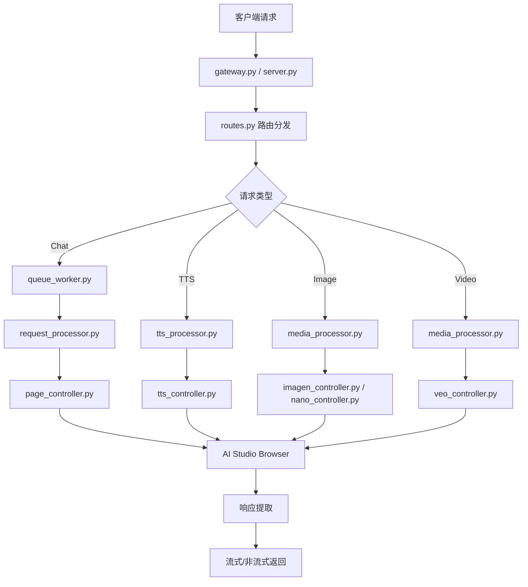

# AIStudio2API 源码结构文档

## 项目概览

AIStudio2API 是一个高性能代理服务，将 Google AI Studio 网页界面转换为 OpenAI 兼容格式 API。

---

## 根目录文件

| 文件 | 描述 |
|------|------|
| `README.md` | 项目中文文档 |
| `README_en.md` | 项目英文文档 |
| `pyproject.toml` | Python 项目配置和依赖声明 |
| `pyrightconfig.json` | Pyright 类型检查配置 |
| `setup.bat` | Windows 一键安装脚本 |
| `setup.sh` | Linux/macOS 一键安装脚本 |
| `start_webui.bat` | WebUI 模式启动脚本 |
| `start_cmd.bat` | 命令行模式启动脚本 |
| `.env.example` | 环境变量示例文件 |
| `.gitignore` | Git 忽略规则 |
| `uv.lock` | uv 依赖锁定文件 |

---

## src/ - 核心源码目录

### 入口文件

| 文件 | 描述 |
|------|------|
| `app_launcher.py` | **图形界面启动器**。启动 WebUI 管理服务 (端口9000)，自动打开浏览器 Dashboard |
| `launch_camoufox.py` | **命令行启动器**。核心启动脚本，处理 Camoufox 浏览器启动、认证管理、代理配置、流式代理等 |
| `server.py` | **主服务器**。定义全局状态变量，创建 FastAPI 应用实例，挂载静态资源 |
| `manager.py` | **WebUI 管理器**。处理 Dashboard API、服务启停、认证文件管理、多 Worker 管理 |
| `gateway.py` | **多 Worker 网关**。负载均衡代理，将请求分发到多个 Worker 实例 |

---

### api/ - API 处理模块

| 文件 | 描述 |
|------|------|
| `__init__.py` | 模块导出定义 |
| `app.py` | FastAPI 应用工厂，配置 lifespan、路由、CORS |
| `routes.py` | **路由定义**。定义所有 API 端点：`/v1/chat/completions`, `/generate-speech`, `/generate-image`, `/generate-video`, `/nano/generate` 等 |
| `request_processor.py` | **请求处理核心**。处理聊天请求的完整生命周期：上下文初始化、模型切换、参数设置、响应处理、流式生成 |
| `queue_worker.py` | **队列工作器**。异步处理请求队列，管理请求排队和执行 |
| `dependencies.py` | FastAPI 依赖注入定义 |
| `utils.py` | 工具函数：消息预处理、Base64 提取、SSE 生成、重试计算 |
| `abort_detector.py` | 客户端中断检测器 |
| `auth_utils.py` | API Key 验证工具 |

---

### browser/ - 浏览器自动化模块

| 文件 | 描述 |
|------|------|
| `__init__.py` | 模块导出定义 |
| `initialization.py` | **浏览器初始化**。Playwright 连接、页面创建、事件监听、脚本注入 |
| `page_controller.py` | **页面控制器**。核心 UI 自动化类：参数设置、系统指令、思考模式、图片上传、提交、响应获取 |
| `operations.py` | **通用操作函数**。点击、重试、断开检查、响应获取、错误快照、模型列表解析 |
| `model_management.py` | **模型管理**。模型切换、UI 状态验证、排除模型加载 |
| `script_manager.py` | 油猴脚本管理，用于模型注入 |
| `thinking_normalizer.py` | 思考参数解析和规范化 |
| `more_models.js` | 油猴脚本，注入额外模型到 AI Studio |

---

### config/ - 配置管理

| 文件 | 描述 |
|------|------|
| `__init__.py` | 导出所有配置常量 |
| `constants.py` | 全局常量：模型名称、ID前缀、默认参数等 |
| `settings.py` | 环境变量设置：调试开关、认证配置、路径定义 |
| `timeouts.py` | **超时和时间常量**。包含所有 sleep/timeout/retry/delay 统一常量 |
| `selectors.py` | **主选择器**。AI Studio 核心页面元素 CSS/XPath 选择器 |
| `tts_selectors.py` | TTS 页面选择器 |
| `imagen_selectors.py` | Imagen 页面选择器 |
| `veo_selectors.py` | Veo 页面选择器 |
| `nano_selectors.py` | Nano Banana 页面选择器 |

#### timeouts.py 常量分类

| 类别 | 示例常量 | 用途 |
|------|----------|------|
| Sleep | `SLEEP_TICK`, `SLEEP_RETRY`, `SLEEP_NAVIGATION` | UI操作等待时间 |
| Delay | `DELAY_AFTER_CLICK`, `DELAY_AFTER_FILL` | 操作后延迟 |
| Timeout | `TIMEOUT_ELEMENT_VISIBLE`, `TIMEOUT_PAGE_NAVIGATION` | 超时限制 |
| Retry | `MAX_RETRIES`, `BASE_STREAM_RETRIES` | 重试次数 |
| URL | `NEW_CHAT_URL` | 固定URL模板 |

---

### tts/ - TTS 语音生成模块

| 文件 | 描述 |
|------|------|
| `__init__.py` | 模块导出 |
| `models.py` | TTS 数据模型定义 |
| `tts_controller.py` | **TTS 控制器**。语音模式切换、说话人配置、文本输入、音频生成等待 |
| `tts_processor.py` | TTS 请求处理，调用控制器完成生成 |

---

### media/ - 媒体生成模块

| 文件 | 描述 |
|------|------|
| `__init__.py` | 模块导出 |
| `models.py` | 媒体生成数据模型 |
| `imagen_controller.py` | **Imagen 控制器**。图片生成参数设置、提示输入、生成等待、图片提取 |
| `veo_controller.py` | **Veo 控制器**。视频生成参数设置、提示输入、参考图上传、视频等待和提取 |
| `nano_controller.py` | **Nano Banana 控制器**。Gemini 图片生成、参考图上传、结果提取 |
| `media_processor.py` | 媒体请求处理，调用对应控制器 |

---

### proxy/ - 流式代理模块

| 文件 | 描述 |
|------|------|
| `__init__.py` | 模块导出 |
| `server.py` | HTTPS 代理服务器实现 |
| `connection.py` | 连接管理和流量拦截 |
| `handler.py` | 请求处理器 |
| `runner.py` | 代理启动器 |

---

### worker/ - 多 Worker 管理模块

| 文件 | 描述 |
|------|------|
| `__init__.py` | 模块导出 |
| `models.py` | Worker 数据模型 |
| `pool.py` | **Worker 池管理**。多账号 Worker 创建、状态管理、速率限制追踪 |

---

### logger/ - 日志模块

| 文件 | 描述 |
|------|------|
| `__init__.py` | 模块导出 |
| `config.py` | 日志配置，支持文件和 WebSocket 输出 |

---

### static/ - 静态资源

| 文件 | 描述 |
|------|------|
| `dashboard.html` | **WebUI Dashboard**。Vue 3 单文件应用，服务管理、日志查看、聊天测试、配置管理 |
| `i18n.js` | 国际化翻译文件，支持中/英/日/繁体等 |
| `icons.js` | SVG 图标定义 |

---

## llm/ - Ollama 兼容层

| 文件 | 描述 |
|------|------|
| `llm.py` | Ollama 格式 API 兼容层，转发请求到主服务 |

---

## camoufox/ - Camoufox 脚本

| 文件 | 描述 |
|------|------|
| `fetch_camoufox_data.py` | Camoufox 数据获取脚本 |
| `update_browserforge_data.py` | BrowserForge 数据更新脚本 |

---

## docker/ - Docker 配置

| 文件 | 描述 |
|------|------|
| `Dockerfile` | Docker 镜像构建文件 |
| `docker-compose.yml` | Docker Compose 编排文件 |
| `supervisord.conf` | Supervisord 进程管理配置 |
| `.dockerignore` | Docker 构建忽略规则 |

---

## docs/ - 详细文档

| 文件 | 描述 |
|------|------|
| `installation-guide.md` | 安装指南 |
| `authentication-setup.md` | 认证设置说明 |
| `api-usage.md` | API 使用指南 |
| `tts-guide.md` | TTS 语音生成指南 |
| `media-generation-guide.md` | 媒体生成指南 |
| `multi-worker-guide.md` | 多 Worker 模式说明 |
| `docker-deployment.md` | Docker 部署指南 |
| `development-guide.md` | 开发指南 |
| `project-structure.md` | 项目结构说明 (本文档) |
| `dependency-versions.md` | 依赖版本说明 |
| `reverse-engineering-internals.md` | 逆向工程内部文档 |
| `client-stop-mechanisms-analysis.md` | 客户端中断机制分析 |

---

## data/ - 运行时数据目录

| 目录/文件 | 描述 |
|----------|------|
| `auth_profiles/` | 认证文件存储目录 |
| `certs/` | HTTPS 证书存储 |
| `key.txt` | API Key 存储 |
| `gui_config.json` | WebUI 配置 |

---

## 核心数据流

